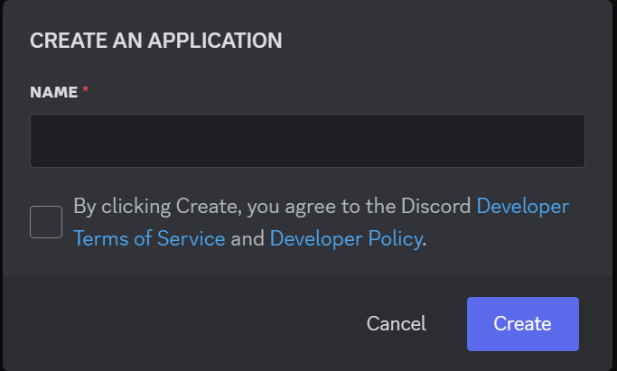

# Ryo-Discord-Bot
ローカルサーバ用のDiscord Botです。

## コマンド一覧
このDiscord Botで使用できるコマンド一覧
| コマンド | 使い方 |
|---|---|
| /omikuji [1~3の整数] | 引数で渡した回数おみくじを引きます |
| /neo_omikuji | 説明付きのおみくじを引きます |

## Dockerコンテナで実行
1. BOTのトークンを取得 ※以下BOT作成手順参照
2. `git clone https://github.com/ryo-icy/ryo-discord-bot`
3. `docker-compose.yaml`のDISCORD_TOKENにBOTのトークンを入力
4. `docker compose up -d`

> [!NOTE]
> 開発時は`docker-compose.yaml`のimageをコメントアウトし、buildをアンコメントする

## BOT作成手順
1. [Developer portal](https://discord.com/developers/applications/)からApplicationを作成
    1. 右上の"New Application"をクリック
    
        

    2. 表示されたモーダルウィンドウにDiscord Bot名を入力し、チェックボックスにチェックをつけて"Create"をクリック

        
    
    3. 左メニューから"Installation"をクリックし、以下を設定
        | 設定項目 | 設定値 |
        |---|---|
        | Installation Contexts | □User Install / ■Guild Install |
        | Install Link | None |
    
    4. 左メニューから"Bot"をクリックし、以下を設定
        | 設定項目 | 設定値 |
        |---|---|
        | PUBLIC BOT | OFF |
        | Presence Intent | ON |
        | Server Members Intent | ON |
        | Message Content Intent | ON |
    
    5. "Token"の"Reset Token"をクリックし、トークンを取得する

    6. 左メニューから"OAuth2"をクリックし、以下の順番で招待用リンクを発行
        1. "OAuth2 URL Generator"の"Scope"から"bot"を選択
        2. "OAuth2 URL Generator"の"Bot Permissions"から"View Channels"と"Send Messages"を選択
        3. "OAuth2 URL Generator"の"Generated URL"をコピー
2. BOT招待用のリンクにアクセスし、参加させたいサーバを選択